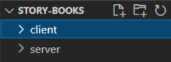

# How to containerize a MERN stack application?
If you're the one who's having problem in containerizing a MERN stack application, then I got you! In this blog we'll containerize a MERN stack application together. So without further delay let's get started with the pure basic.

# What is MERN stack?
Each letter of the MERN stands for a specific technology, which are **M**ongoDB, **E**xpress, **R**eactJS, **N**odeJS MERN stack is a combined pack of client side application(frontend), a backend server(built with ExpressJS & NodeJS) and a database(MongoDB). 

# What are containers or, What does it mean to containerize an application?
Containers are nothing but a virtual environment where the image of any application can run. It enables us to test an application on our local machines without having any prior setup, but the only pre-requisite is that we should have Docker pre-installed in our machine. There are many such tools that we can use to containerize an application but in this article, we're going to use **Docker** for containerizing our application. 

# Why should I containerize?
There are many benefits of containerizing an application, but let's discuss a few sole benefits:
1) It enables very quick, easy, and scalable deployments.
2) It doesn't require any operating system, so it is independent of any operating system.

</img> <br>
**Note:-First of all you should check that you should have 2 different directories one for client side application (i.e, react-app) and other for our server file.**
<br> <br>

### Let's containerize the application:
We're going to set up 3 containers for Mongo, express-server, and our react-app. 
#### 1. So, let's containerize our react-app first. 
It's quite simple to dockerize a react-app with a `Dockerfile`.
```yml
  #here we're specifying the version of node
  #we can use the :latest tag as well.
  FROM node:14-slim

  #here we're defining the working directory
  WORKDIR /user/src/app

  #copying our dependencies to the container
  COPY ./package.json ./
  COPY ./package-lock.json ./

  #installing all the dependencies that we copied 
  RUN npm install

  #copying all the files inside the container
  COPY . .

  #exposing the port so we can access it further
  EXPOSE 3000

  #starting the application
  CMD ["npm", "start"]
```
Now with the help of this `Dockerfile` we can build and containerize our react-app, **to build this application using Dockerfile run this command inside your client directory where only the code of react-app reside.**
```docker
docker build -t react-app:0.1 .
```

#### 3. Defining different services that will enable our containers to talk with each other. 
**Note: We're going to use the official image of MongoDB which has been kept on Docker-Hub by the MongoDB company itself. So it is recommend to check your monogDB url. If you're using mongoDB atlaas then you don't need to create a container for that you can remove un-necessary code from the docker-compose file**

We're going to make a `docker-compose` file in our main directory where our client and server folder resides, and via `docker-compose` we can specify different rules to the containers. 
In the `docker-compose` file we're going to define services and specify the location of all the Dockerfiles that will help us to **build, test, and run all the containers from one command**.
So, let's go through the `docker-compose` file
```yaml
version: "3"
services:
  react-app:
    #here we've to specify the location of our Makefile
    build: ./client/
    stdin_open: true
    #here we're mapping the exposed port i.e, 3000 to our machine port 3000.
    # so that we can test the application on our port 3000.
    ports: 
      - "3000:3000"
    networks:
      - mern-app
    volumes:
      - ./server/:/usr/src/app
      - /usr/src/app/node_modules
  api-server:
    #here we've to specify the location of our Makefile
    # build: ./server/
    ports:
    #here we're mapping the exposed port i.e, 5000 to our machine port 5000.
    # so that we can test the application on our port 5000.
      - "5000:5000"
    networks:
      - mern-app
    volumes:
      - ./server/:/usr/src/app
      - /usr/src/app/node_modules
    depends_on:
      - mongo
  mongo:
    #instead of build tag we're using image tag because we're using the official image of MongoDB
    #this will pull the official image from the docker hub.
    image: mongo:4.4-bionic
    ports:
      - "27017:27017"
    networks:
      - mern-app
    volumes:
      - mongo-data:/data/db
networks:
  mern-app:
    driver: bridge
volumes:
  mongo-data:
    driver: local
```
Now, we're all set to go but the only thing that is reamining is the `Makefile`. We've to make 2 `Makefile` in both directories (client and server) so that we can 
run the `build` command from the docker-compose file. 
So inside the **client** directory make one`Makefile` and inside it write the build command 
```yml
build:
	docker build -t react-app .
```
similarly, inside the **server** directory specify its build command, i.e,
```yml
build:
	docker build -t api-server .
```
After this has been done, we are ready to go with the testing of our application. As we're using `docker-compose` it is pretty easy to do that, we only have to run one specific command inside our main directory where our **client and server directory resides**.
```yml
docker-compose up
```
This will spin all the specified containers in the `docker-compose` file and we can see the running image of react-app on our forwarded port aka: `localhost:3000`

