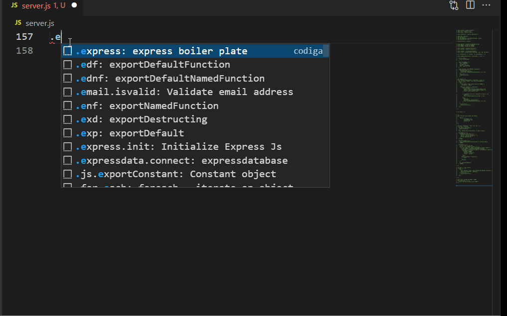

## What do I mean by efficiency in terms of writing code?
It is of the utmost important thing to understand what I mean by the term "efficiency" when considering today's or future developer's world. It includes several characteristics, but let's focus on a majority of them:
* Writing code much faster
* Writing clean cone
* Writing high-quality code
* Writing code while following the best practices, etc.

We already know that these points are really important when writing production-level code, and at the time of hiring company prioritizes the candidate who acquires these capabilities. 
According to the 20th edition of the State of the Developer Nation report, there were 26.8 million active software developers in the world at the end of 2021. And experts predicted that the number of developers will grow to reach 45 million by 2030. Looking at these massive numbers, I want you to think **"How many of them code really in an efficient manner?"**, unfortunately, the answer is heart-melting.

## How can we increase our efficiency when writing code?
As of now, I'm pretty sure that you must have understood what I'm willing to say by the term **"increasing our efficiency"**. So let's get back to the current section i.e, " How can we increase our efficiency when writing code?". To improve our efficiency there are many things that we've to keep in our mind,
* It comes with practice and experience
* You have to learn alternative ways to solve one specific problem
* You have to think before you start writing code, etc

I know these processes are tedious and will take time, but trust me there is nothing to worry about. Because this article is having a piece of good news for all the readers. So without further ado, let's open the gift and see what is there inside for you all.

# 
<table>
  <tr>
    <td></td>
    <td>The main aim of <a href="https://www.codiga.io/">Codiga</a> is to enable developers in writing better code faster. </td> 
  </tr>
</table>
# How does it work?
You might be thinking that how Codiga works, **do it uses our data to train its AI model or recommended systems**, that suggest to us code snippets?

The answer is pretty straightforward, **No it doesn't** use any AI-based algorithm and hence you don't have to worry about your data. Under the hood, it works in a way such that it detects whatever IDE you're using and then the language of the file using their respective file extensions. And now it is up to you which recipe you want to cook inside your IDE. 

Let us assume that you are working on JavaScript and you want the snippet of fetch function to make a get request to some server. To achieve this, you only have to type `"."` or `"/"` and it will start recommending a bunch of snippets but you have to be more specific to get the specific snippets. So start by writing `.request.get` or `.fetch` and it'll recommend you the snippet for the fetch function to make a `GET` request, the only thing now you have to do is press `enter` and select our appropriate snippets. After selecting the `.request.get`, you will end up writing code for making a`GET` request.

Let's look at one example where I'll create a complete end to end ExpressJS application using **Codiga** in less than a minute,

# What are the features that it provides? 
After understanding the flow/working of Codiga, you might have got some ideas about the benefits that you can get via this tool. If not then let's go through them one by one,
* Ensures high-quality Code 
> You can make use of the code snippets that are written by top-notch engineers.
* Increases productivity by more than 10times (>10x)
> As it recommends many snippets that might take you more than a min to write, using the power of Codiga you end up in less than 1sec. 
* Context-based suggestions
> Code Snippets are suggested in your IDE context: language, filename, and dependencies
* Supports more than 15 Languages/Frameworks
> These languages include JavaScript(React, Next, etc), Python, GO, YAML, Java, and many more. 
* Add your own code snippets in seconds
> You may keep them private or share them with your friends and team without leaving your developer environment.
* Automated Code Reviews
> From every Commit and Pull Request Codiga surface the most pernicious defects on your projects. Codiga analysis engine is available anywhere developers read or write code by installing a plugin in your developer environment.
* Flexible and Scalable
> Codiga lets you create Code Snippets suggestions for you and your team and it's very easy to set up.
You may refer to this [article](https://dev.to/theinfosecguy/create-use-code-snippets-using-codiga-code-snippets-oa7) in case you wish to start creating and using code snippets immediately.

# What are the problems that it solves? 
We have discussed few points in the **How can we increase our efficiency when writing code?** section and we saw that it is a time taking process. But considering the aim of Codiga which says it enables developer's in writing better code faster. With Codiga you can 
* write high quality code by importing Smart Code Snippets, 
* increase your productivity by more than 10times,
* speed up your coding

### We can't wait to see what reciepe's/cookbook's you are planning to prepare for the world of developers!
